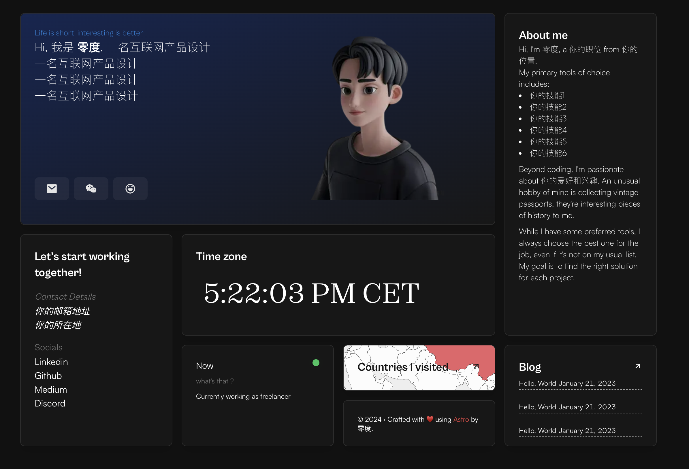

# ⚡️astro-bento-portfolio

## 使用`Astro`构建的个人作品集网站



查看演示示例，**[点击这里](https://sparkly-speculoos-0c9197.netlify.app/)**

## 特点

- 现代简约的便当盒(Bento)风格，简洁的UI设计
- 几乎所有内容都在一个页面上
- 完全响应式设计
- 性能和SEO优化
- 可轻松部署到[Netlify](https://www.netlify.com/)或其他平台
- 博客功能
- RSS支持(your-domain/rss.xml)
- 酷炫的3D地球可视化

## 技术栈

- [Astro](https://astro.build) - 现代静态站点生成器，专为内容驱动的网站优化
  - 支持多框架组件
  - 零JS默认加载（仅在需要时发送JavaScript）
  - 内置内容集合系统
- [UnoCSS](https://unocss.dev/) - 原子化CSS引擎，类似Tailwind但更轻量灵活
- [Motion.js](https://motion.dev/) - 强大的动画库，提供平滑的页面过渡和微交互
- [D3.js](https://d3js.org/) - 数据可视化库，用于构建3D地球组件
- [Solid.js](https://www.solidjs.com/) - 高性能反应式UI库，渲染速度接近原生JavaScript
- [Svelte](https://svelte.dev/) - 编译时框架，无运行时开销，用于部分UI组件

## 开始使用 ▶️

```bash
# 克隆仓库
$ git clone https://github.com/Ladvace/astro-bento-portfolio
```

```bash
# 进入项目目录
$ cd astro-bento-portfolio
```

```bash
# 安装依赖
$ pnpm install
或
$ npm install
```

```bash
# 启动开发服务器
$ pnpm run dev
或
$ npm run dev
```

# 重要提示：确保替换所有个人信息

请务必替换项目中的个人信息，包括但不限于：

- `src/lib/constants.ts` 中的社交媒体链接和邮箱
- `src/components/AboutMe.astro` 中的个人介绍
- `src/components/IntroCard.astro` 中的名字和职位描述
- `astro.config.mjs` 中的网站地址
- `/public/me.webp` 头像图片

## 移除分析脚本

如果存在，请在 `src/layouts/Layout.astro` 中移除 umami 分析脚本标签或替换为您自己的ID。

# 配置

记得在 `astro.config.mjs` 中替换 `site` 和其他属性为您自己的数据。

# 项目结构

- `/src/components/` - 所有UI组件
- `/src/layouts/` - 页面布局模板
- `/src/pages/` - 网站页面
- `/src/lib/` - 工具函数和常量
- `/public/` - 静态资源（图片、字体等）

# 部署方式

## Netlify 部署 🚀

在Netlify上部署网站是可选的，但推荐使用以便快速轻松部署。

您只需fork此仓库并将其链接到您的Netlify账户。

或者

[](https://app.netlify.com/start/deploy?repository=https://github.com/Ladvace/astro-bento-portfolio)

## 其他部署选项

本项目也可以部署到其他平台：

- **静态部署**：修改`astro.config.mjs`中的`output`为`"static"`并删除适配器配置
- **Vercel**：安装`@astrojs/vercel`适配器并更新配置
- **Cloudflare Pages**：安装`@astrojs/cloudflare`适配器并更新配置
- **GitHub Pages**：配置为静态输出后可直接部署

## 原作者 ❤️

- Gianmarco - https://github.com/Ladvace
