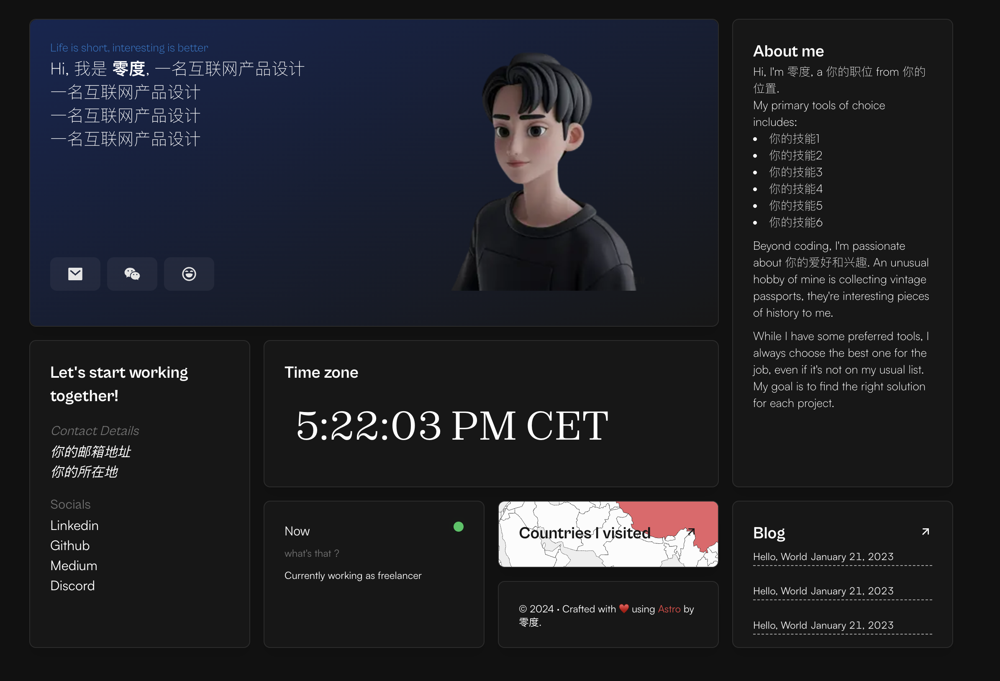

# ⚡️astro-bento-portfolio

## 使用`Astro`构建的个人作品集网站



查看演示示例，**[点击这里](https://sparkly-speculoos-0c9197.netlify.app/)**

## 特点

- 现代简约的便当盒(Bento)风格，简洁的UI设计
- 几乎所有内容都在一个页面上
- 完全响应式设计
- 性能和SEO优化
- 可轻松部署到[Netlify](https://www.netlify.com/)或其他平台
- 博客功能
- RSS支持(your-domain/rss.xml)

## 技术栈

- [Astro](https://astro.build) - 现代静态站点生成器，专为内容驱动的网站优化
  - 支持多框架组件
  - 零JS默认加载（仅在需要时发送JavaScript）
  - 内置内容集合系统
- [UnoCSS](https://unocss.dev/) - 原子化CSS引擎，类似Tailwind但更轻量灵活
- [Motion.js](https://motion.dev/) - 强大的动画库，提供平滑的页面过渡和微交互
- [D3.js](https://d3js.org/) - 数据可视化库，用于构建3D地球组件
- [Solid.js](https://www.solidjs.com/) - 高性能反应式UI库，渲染速度接近原生JavaScript
- [Svelte](https://svelte.dev/) - 编译时框架，无运行时开销，用于部分UI组件

## 开始使用 ▶️

```bash
# 克隆仓库
$ git clone https://github.com/Ladvace/astro-bento-portfolio
```

```bash
# 进入项目目录
$ cd astro-bento-portfolio
```

```bash
# 安装依赖
$ pnpm install
或
$ npm install
```

```bash
# 启动开发服务器
$ pnpm run dev
或
$ npm run dev
```

## 首页版本切换

当前项目保留了两版首页，方便新版设计迭代时随时对照或回退：

- 新版首页：`/`，源码在 `src/pages/index.astro`
- 旧版 Bento 首页：`/home-classic`，源码在 `src/pages/home-classic.astro`

如果需要临时查看旧版，启动开发服务器后访问：

```text
http://localhost:4321/home-classic
```

如果需要正式切回旧版首页，把 `src/pages/home-classic.astro` 的页面内容替换到 `src/pages/index.astro`。不要删除 `home-classic.astro`，它作为旧版备份保留。

## 2026-05-05 更新记录

本次更新围绕新版首页、内容资产、交互细节和 SEO 基础能力完成。

### 首页新版架构

- 新版首页入口为 `src/pages/index.astro`。
- 旧版 Bento 首页保留为 `src/pages/home-classic.astro`，访问路径为 `/home-classic`。
- 首页数据集中放在 `src/data/home.ts`，包括导航、主视觉文案、精选项目、个人介绍、社交链接、信号日志和彩蛋语录。
- 首页专用组件放在 `src/components/home/`：
  - `HomeSidebar.astro`：左侧品牌、导航、邮箱、微信、彩蛋入口。
  - `HeroIdentity.astro`：主标题、签名图、时钟、主视觉区域。
  - `SelectedWorks.astro`：首页精选项目卡片。
  - `ProfilePanel.astro`：关于我、核心技能、信号日志容器。
  - `ThoughtTimeline.astro`：信号日志时间线。
  - `AboutModal.astro`：关于我的全局弹窗。
  - `HomeFooter.astro`：首页底部信息。

### 首页资产

- 首页主视觉人物图：`public/images/home/home-portrait-main.png`。
- 首页手写签名图：`public/images/home/zero-yue-signature.png`。
- 左侧品牌图形：`public/images/home/zero-yue-brand-mark.svg`。
- 自定义鼠标准心：`public/cursors/crosshair.svg`，热点坐标为 `16 16`，透明度为 80%。
- 本地字体：
  - `public/fonts/CabinetGrotesk-Variable.ttf`
  - `public/fonts/Satoshi-Variable.ttf`
  - `public/fonts/Satoshi-VariableItalic.ttf`
  - `public/fonts/Didot.ttf`

### 交互更新

- 左侧邮箱入口改为 hover 显示邮箱地址，点击后打开邮件发送。
- 左侧微信入口保留 hover 显示二维码。
- 左侧笑脸入口改为中文经典语录彩蛋，按下时在侧边弹出，抬起后约 0.5 秒消失。
- `About` 和 `Read More` 会打开关于我的弹窗，弹窗内包含旧版关于我介绍和社交平台链接。
- `View All Projects` 暂时保留视觉样式，但移除了跳转链接。
- 左侧菜单顺序已调整为 `Work`、`Blog`、`Lab`、`About`。

### 内容更新

- 新增博客文章：`src/data/blog/claude-design-prompts.md`。
- 新增 Claude Design 网站项目预览图：`public/lab/claude-design-guide-preview.png`。
- 新增 IconCook 网站项目预览图：`public/lab/iconcook-preview.png`。
- Lab 页面按项目时间从新到旧排序。
- 首页 `Selected Works` 当前展示：
  - `Claude Design`
  - `IconCook`
  - `Early design works`
  - `Project Lab`

### SEO 与构建

- 页面语言设置为 `zh-CN`。
- 补齐 canonical URL，`og:url` 跟随页面规范地址。
- 旧版首页 `/home-classic` 设置为 `noindex, follow`，避免和新版首页重复收录。
- 精选项目图片补充了非空 `alt`。
- 移除了构建阶段对 Fontshare 的依赖，当前字体全部走本地文件。
- `public/_headers` 和 `netlify.toml` 已同步移除 Fontshare 白名单。

### 验证

本次更新后已执行：

```bash
pnpm run build
```

构建通过。当前剩余的构建日志噪音主要来自 Node experimental warning 和博客页面里已有的 `headings` 调试输出，和 Fontshare 无关。

# 重要提示：确保替换所有个人信息

请务必替换项目中的个人信息，包括但不限于：

- `src/lib/constants.ts` 中的社交媒体链接和邮箱
- `src/components/AboutMe.astro` 中的个人介绍
- `src/components/IntroCard.astro` 中的名字和职位描述
- `astro.config.mjs` 中的网站地址
- `/public/me.webp` 头像图片

## 移除分析脚本

如果存在，请在 `src/layouts/Layout.astro` 中移除 umami 分析脚本标签或替换为您自己的ID。

# 配置

记得在 `astro.config.mjs` 中替换 `site` 和其他属性为您自己的数据。

# 项目结构

- `/src/components/` - 所有UI组件
- `/src/layouts/` - 页面布局模板
- `/src/pages/` - 网站页面
- `/src/lib/` - 工具函数和常量
- `/public/` - 静态资源（图片、字体等）

# 部署方式

## Netlify 部署 🚀

在Netlify上部署网站是可选的，但推荐使用以便快速轻松部署。

您只需fork此仓库并将其链接到您的Netlify账户。

或者

[](https://app.netlify.com/start/deploy?repository=https://github.com/Ladvace/astro-bento-portfolio)

## 其他部署选项

本项目也可以部署到其他平台：

- **静态部署**：修改`astro.config.mjs`中的`output`为`"static"`并删除适配器配置
- **Vercel**：安装`@astrojs/vercel`适配器并更新配置
- **Cloudflare Pages**：安装`@astrojs/cloudflare`适配器并更新配置
- **GitHub Pages**：配置为静态输出后可直接部署

## 原作者 ❤️

- Gianmarco - https://github.com/Ladvace
